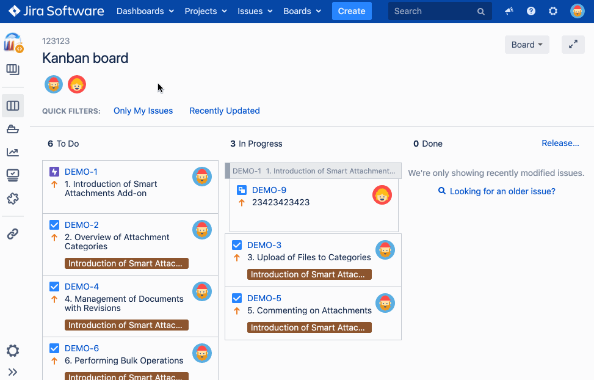

# JIRA Assignee Filter Chrome Extension
[](https://github.com/anttiviljami/jira-assignee-filter-chrome-extension/blob/master/LICENSE)

Adds an assignee filter for JIRA Boards.



## Installation

Download the latest release from the [Releases page]()

Navigate to [`chrome://extensions`](chrome://extensions)

Turn on `Developer Mode`


Click on `Load unpacked` and select the cloned repository

## Development

```
npm install
npm run dev
```

